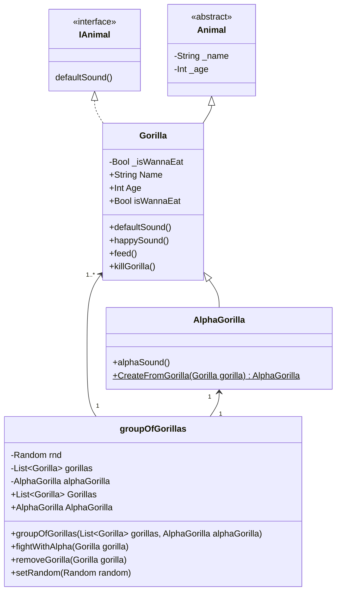

```mermaid
classDiagram
    class IAnimal {
        <<interface>>
        defaultSound()
    }
    
    class Animal {
        <<abstract>>
        -String _name
        -Int _age
    }
    
    class Gorilla {
        -Bool _isWannaEat
        +String Name
        +Int Age
        +Bool isWannaEat
        +defaultSound()
        +happySound()
        +feed()
        +killGorilla()
    }
    
    class AlphaGorilla {
        +alphaSound()
        +CreateFromGorilla(Gorilla gorilla)AlphaGorilla$
    }
    
    class groupOfGorillas {
        -Random rnd
        -List~Gorilla~ gorillas
        -AlphaGorilla alphaGorilla
        +List~Gorilla~ Gorillas
        +AlphaGorilla AlphaGorilla
        +groupOfGorillas(List~Gorilla~ gorillas, AlphaGorilla alphaGorilla)
        +fightWithAlpha(Gorilla gorilla)
        +removeGorilla(Gorilla gorilla)
        +setRandom(Random random)
    }
    
    IAnimal <|.. Gorilla
    Animal <|-- Gorilla
    Gorilla <|-- AlphaGorilla
    Gorilla "1..*" <-- "1" groupOfGorillas
    AlphaGorilla "1" <-- "1" groupOfGorillas
```
