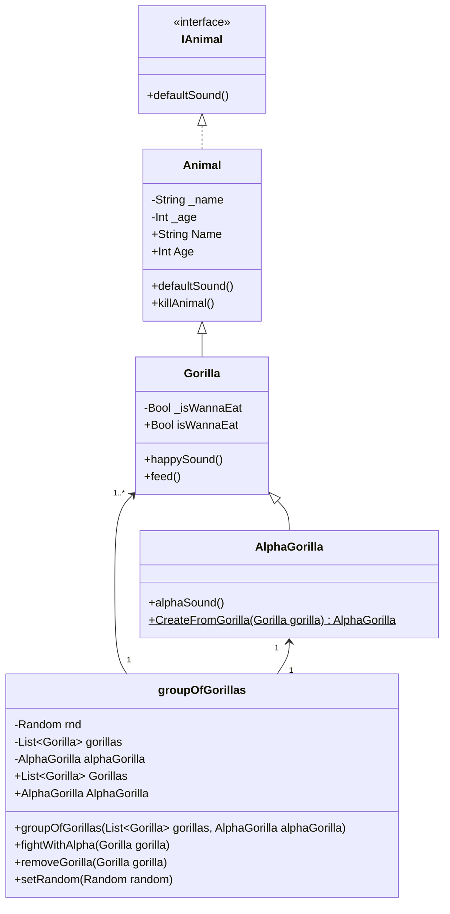

## Переделанные классы
```
interface IAnimal
{
    public void defaultSound() { }
}

public class Animal : IAnimal
{
    private string _name;
    private int _age;
    public Animal(string _name, int _age)
    {
        this._name = _name;
        this._age = _age;
    }

    public string Name
    {
        get { return _name; }
        set { _name = value; }
    }

    public int Age
    {
        get { return _age; }
        set { _age = value; }
    }
    public void defaultSound()
    {
        Console.WriteLine("ху-ху-ху");
    }

    virtual public void killAnimal()
    {
        Console.WriteLine($"{_name} is dead");
    }
}

public class Gorilla : Animal
{
    private bool _isWannaEat;

    public Gorilla(string _name, int _age, bool _isWannaEat) : base (_name, _age)
    {
        this._isWannaEat = _isWannaEat;
    }        

    public bool isWannaEat
    {
        get { return _isWannaEat; }
        set { _isWannaEat = value; }
    }        

    public void happySound() 
    {
        Console.WriteLine("Уму-му-му");
    }
    
    public void feed()
    {
        if (_isWannaEat)
            isWannaEat = false;
        happySound();
    }        
}

public class AlphaGorilla : Gorilla
{
    public AlphaGorilla(string name, int age, bool isWannaEat) : base(name, age, isWannaEat)
    {
        
    }

    public void alphaSound()
    {
        Console.WriteLine("Уаааааааа");
    }

    public static AlphaGorilla CreateFromGorilla(Gorilla gorilla)
    {
        return new AlphaGorilla(gorilla.Name, gorilla.Age, gorilla.isWannaEat);
    }
}

public class groupOfGorillas()
{
    private Random rnd;
    private List<Gorilla> gorillas;
    private AlphaGorilla alphaGorilla;

    public List<Gorilla> Gorillas
    {
        get { return gorillas; }
        private set { gorillas = value; }
    }

    public AlphaGorilla AlphaGorilla
    {
        get { return alphaGorilla; }
        private set { alphaGorilla = value; }
    }

    public groupOfGorillas(List<Gorilla> gorillas, AlphaGorilla alphaGorilla) : this()
    {
        this.gorillas = gorillas;
        this.alphaGorilla = alphaGorilla;
        SetRandom(new Random());
    }

    public void fightWithAlpha(Gorilla gorilla)
    {            
        if (!gorilla.isWannaEat)
        {
            if (!alphaGorilla.isWannaEat)
            {
                if (rnd.Next(1,10) % 3 == 0)
                {
                    alphaGorilla = AlphaGorilla.CreateFromGorilla(gorilla);
                    gorillas.Remove(gorilla);
                }
                    
                else
                    removeGorilla(gorilla); 
            }
            else
            {
                alphaGorilla = AlphaGorilla.CreateFromGorilla(gorilla);
                gorillas.Remove(gorilla);
            }
        }
    }

    public void removeGorilla(Gorilla gorilla)
    {
        gorilla.killAnimal();
        gorillas.Remove(gorilla);
    }

    public void SetRandom(Random random)
    {
        rnd = random;
    }
}
```
